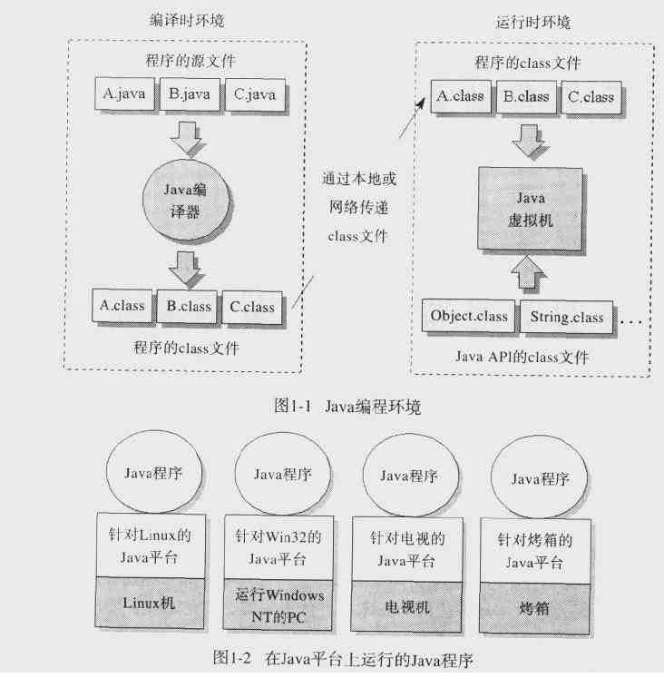

&emsp;&emsp;近来阅读《深入java虚拟机》,便把书中的一些知识整理成笔记发表到博客上，和大家一同学习。
<h3>Java的体系结构</h3>
&emsp;&emsp;Java体系结构包括四个部分：
&emsp;&emsp;1、Java程序设计语言
&emsp;&emsp;2、Java class 文件格式
&emsp;&emsp;3、Java应用编程接口(Java API)
&emsp;&emsp;4、Java虚拟机

&emsp;&emsp;我们使用Java程序设计语言编写源代码（.Java文件），Java编译器将其编译为class文件，然后再JVM中运行class文件，在程序运行过程中，JVM通过调用class文件中实现了Java API的方法来满足程序的Java API调用。
&emsp;&emsp;JVM和Java API构成Java的运行时环境。四者之间的具体关系请看下图：

> 如有任何知识产权、版权问题或理论错误，还请指正。
>
> 转载请注明原作者及以上信息。
